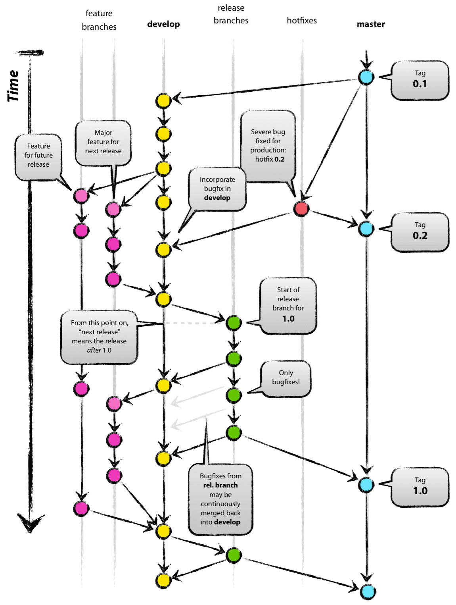

# Git Cheatsheet

## Github
Github create new repo with the same name. 

```shell
git init 
git add -a
git commit -m "first commit"
git branch -M main 
git remote add origin git@github.com:jacobtianzeyu/my-package.git
git push -u origin main 
git rm -r --cache files/or/folders/to/exclude
git add -A
git status 

```
standard [.gitignore](https://github.com/github/gitignore/blob/main/Python.gitignore)

git commit message: 
```shell
[type] [optional scope]: [description]

[optional body]

[optional footer(s)]
```

example: 
```shell
test: add negative test for entering mobile number

add test scenario to check if entering character as mobile number is forbidden 

TST-145
```


- [type]: 
  - fix: patches a bug in our codebase
  - feat: introduces a new feature
  - refactor: introduce a breaking 
  - docs
  - build
  - chore
  - style
  - perf
  - test

The symbol [!] can be used with any type. It signifies a breaking change that correlates with MAJOR in semantic versioning

- [scope]: this is optional

- [summary]: should not be long 

- [body]: optional, explain motivation of change

- [footer]: jira/issue id 

### How to start an 'orphan' new branch

Developers often want to create empty branches. They can't create it using GUI, because SourceTree can create branch only from working copy parent or specified commit.
To create empty branch, you have to go to terminal and execute. 

--orphan creates a new branch, but it starts without any commit. After running the above command you are on a new branch "NEWBRANCH", and the first commit you create from this state will start a new history without any ancestry.
You can then start adding files and commit them and they will live in their own branch. If you take a look at the log, you will see that it is isolated from the original log.

```shell
 
git checkout --orphan NEWBRANCH
git rm -rf .

add files

git add .

git commit -m "commit message"

git push -u origin branchname


# remove git branch
## delete local
git branch -d <branchname>
## delete remote
git push origin --delete remote_branch


```
## Best Practise for git project
For collaboration projects, there are usually 2 branches.

  main branch

  * main branch - production branch, runnable
  * develop branch

  supporting branch

  * hotfixes - staging (limited lifetime)
  * release branches (limited lifetime)
  * feature branches (limited lifetime)



The thought process here is that you spend most of your time in development. When in development, you create a feature branch (off of development), complete the feature, and then merge back into development. This can then be added to the final production version by merging into production.

At the core, the development model is greatly inspired by existing models out there. The central repo holds two main branches with an infinite lifetime:
  * main
  * develop

The master branch at origin should be familiar to every Git user. Parallel to the master branch, another branch exists called develop.

We consider origin/master to be the main branch where the source code of HEAD always reflects a production-ready state.

We consider origin/develop to be the main branch where the source code of HEAD always reflects a state with the latest delivered development changes for the next release. Some would call this the “integration branch”. This is where any automatic nightly builds are built from.

When the source code in the develop branch reaches a stable point and is ready to be released, all of the changes should be merged back into master somehow and then tagged with a release number. How this is done in detail will be discussed further on.

Therefore, each time when changes are merged back into master, this is a new production release by definition. We tend to be very strict at this, so that theoretically, we could use a Git hook script to automatically build and roll-out our software to our production servers everytime there was a commit on master.

Our development model uses a variety of supporting branches to aid parallel development between team members, ease tracking of features, prepare for production releases and to assist in quickly fixing live production problems. Unlike the main branches, these branches always have a limited life time, since they will be removed eventually.

The different types of branches we may use are:

  * Feature branches: may branch off from `develop`, must merge back into `develop`, naming convention: anything except `master`, `develop`, `release-*`, or `hotfix-*`
  * Release branches: May branch off from `develop`, must merge back into `develop` and `master`, branch naming convention `release-*`
  * Hotfix branches: May branch off from  `master`, must merge back into `develop` and `master`, branch naming convention `hotfix-*`

Each of these branches have a specific purpose and are bound to strict rules as to which branches may be their originating branch and which branches must be their merge targets.

**Feature branches** (or sometimes called topic branches) are used to develop new features for the upcoming or a distant future release. When starting development of a feature, the target release in which this feature will be incorporated may well be unknown at that point. The essence of a feature branch is that it exists as long as the feature is in development, but will eventually be merged back into develop (to definitely add the new feature to the upcoming release) or discarded (in case of a disappointing experiment). Feature branches typically exist in developer repos only, not in origin

**Release branches** support preparation of a new production release. They allow for last-minute dotting of i’s and crossing t’s. Furthermore, they allow for minor bug fixes and preparing meta-data for a release (version number, build dates, etc.). By doing all of this work on a release branch, the develop branch is cleared to receive features for the next big release. The key moment to branch off a new release branch from develop is when develop (almost) reflects the desired state of the new release. At least all features that are targeted for the release-to-be-built must be merged in to develop at this point in time. All features targeted at future releases may not—they must wait until after the release branch is branched off.
It is exactly at the start of a release branch that the upcoming release gets assigned a version number—not any earlier. Up until that moment, the develop branch reflected changes for the “next release”, but it is unclear whether that “next release” will eventually become 0.3 or 1.0, until the release branch is started. That decision is made on the start of the release branch and is carried out by the project’s rules on version number bumping.
**Release branches are created from the develop branch.** bug fixes may be applied in this branch (rather than on the develop branch). Adding large new features here is strictly prohibited. They must be merged into develop, and therefore, wait for the next big release.

**Hotfix branches** are very much like release branches in that they are also meant to prepare for a new production release, albeit unplanned. They arise from the necessity to act immediately upon an undesired state of a live production version. When a critical bug in a production version must be resolved immediately, a hotfix branch may be branched off from the corresponding tag on the master branch that marks the production version.
The essence is that work of team members (on the develop branch) can continue, while another person is preparing a quick production fix.

### feature branch

```shell 
#Switched to a new branch "myfeature"
$ git checkout -b myfeature develop

#Incorporating a finished feature on develop 
#Switched to branch 'develop'
$ git checkout develop
#Updating ea1b82a..05e9557
#(Summary of changes)
$ git merge --no-ff myfeature
# Deleted branch myfeature (was 05e9557).
$ git branch -d myfeature
$ git push origin develop
```

The --no-ff flag causes the merge to always create a new commit object, even if the merge could be performed with a fast-forward. This avoids losing information about the historical existence of a feature branch and groups together all commits that together added the feature. 


In the latter case, it is impossible to see from the Git history which of the commit objects together have implemented a feature—you would have to manually read all the log messages. Reverting a whole feature (i.e. a group of commits), is a true headache in the latter situation, whereas it is easily done if the --no-ff flag was used.

### release branch

```shell
$ git checkout -b release-1.2 develop
#Switched to a new branch "release-1.2"
$ ./bump-version.sh 1.2
#Files modified successfully, version bumped to 1.2.
$ git commit -a -m "Bumped version number to 1.2"
#[release-1.2 74d9424] Bumped version number to 1.2
#1 files changed, 1 insertions(+), 1 deletions(-)

# Finishing a release branch
$ git checkout master
#Switched to branch 'master'
$ git merge --no-ff release-1.2
#Merge made by recursive.
#(Summary of changes)
$ git tag -a 1.2

# To keep the changes made in the release branch, we need to merge those back into develop, though
$ git checkout develop
# Switched to branch 'develop'
$ git merge --no-ff release-1.2
# Merge made by recursive.
# (Summary of changes)
# Now we are really done and the release branch may be removed, since we don’t need it anymore
$ git branch -d release-1.2
# Deleted branch release-1.2 (was ff452fe).
```
### hotfix branch 

```shell
$ git checkout -b hotfix-1.2.1 master
# Switched to a new branch "hotfix-1.2.1"
$ ./bump-version.sh 1.2.1
# Files modified successfully, version bumped to 1.2.1.
$ git commit -a -m "Bumped version number to 1.2.1"
# [hotfix-1.2.1 41e61bb] Bumped version number to 1.2.1
# 1 files changed, 1 insertions(+), 1 deletions(-)
$ git commit -m "Fixed severe production problem"
# [hotfix-1.2.1 abbe5d6] Fixed severe production problem
# 5 files changed, 32 insertions(+), 17 deletions(-)

# First, update master and tag the release.
$ git checkout master
# Switched to branch 'master'
$ git merge --no-ff hotfix-1.2.1
# Merge made by recursive.
# (Summary of changes)
$ git tag -a 1.2.1

# Next, include the bugfix in develop, too:
$ git checkout develop
# Switched to branch 'develop'
$ git merge --no-ff hotfix-1.2.1
# Merge made by recursive.
# (Summary of changes)
```
## what is pull request
A pull request is an event in Git where a contributor asks a maintainer of a Git repository to review code they want to merge into a project.

if you want to contribute to a project, the simplest way is to:

* Find a project you want to contribute to
* Fork it
* Clone it to your local system
* Make a new branch
* Make your changes
* Push it back to your repo
* Click the Compare & pull request button
* Click Create pull request to open a new pull request

## Changelog 
A changelog is a file that shares a chronologically ordered list of the changes you've made on your project. It’s often organized by the version with the date followed by a list of added, improved, and removed features.

## Reference
- [https://nvie.com/posts/a-successful-git-branching-model/](https://nvie.com/posts/a-successful-git-branching-model/)
- [https://github.com/joelparkerhenderson/git-commit-message](https://github.com/joelparkerhenderson/git-commit-message)
- [https://reflectoring.io/meaningful-commit-messages/#:~:text=The%20commit%20message%20should%20describe,commit%20message%20can%20be%20helpful.](https://reflectoring.io/meaningful-commit-messages/#:~:text=The%20commit%20message%20should%20describe,commit%20message%20can%20be%20helpful.)
- [https://github.com/github-changelog-generator/github-changelog-generator](https://github.com/github-changelog-generator/github-changelog-generator)

