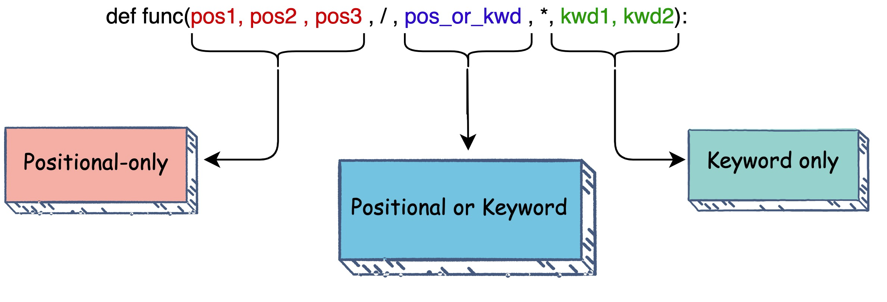

.. post:: 2022.11.02
   :tags: keyword only, position only, PEP3102, PEP570
   :category: Python
   :author: TIAN Zeyu

keyword only and position only argument
########################################

The current Python function-calling paradigm allows arguments to be specified either by position or by keyword.

There are three types of parameters in Python:

    * positional-only parameters,
    * positional-or-keyword parameters, and
    * keyword-only parameters.

.. code-block:: python

    def f(pos1, pos2, /, pos_or_kwd, *, kwd1, kwd2):
      -----------    ----------     ----------
        |             |                  |
        |        Positional or keyword   |
        |                                - Keyword only
         -- Positional only

    # example
    >>> def standard_arg(arg):
    ...     print(arg)
    ...
    >>> def pos_only_arg(arg, /):
    ...     print(arg)
    ...
    >>> def kwd_only_arg(*, arg):
    ...     print(arg)
    ...
    >>> def combined_example(pos_only, /, standard, *, kwd_only):
    ...     print(pos_only, standard, kwd_only)

**keyword-only arguments** - Keyword-only arguments are function arguments which can only be specified using the keyword
syntax, meaning they cannot be specified positionally. Every parameter defined after an asterisk (*) in a function needs
to be passed keyword-only arguments

**positional-only arguments** - When a function accepting positional-only parameters is called, positional arguments are
mapped to these parameters based solely on their order.

As guidance:

* Use positional-only if names do not matter or have no meaning, and there are only a few arguments which will always be passed in the same order.
* Use keyword-only when names have meaning and the function definition is more understandable by being explicit with names.

Reference
==========
- https://peps.python.org/pep-3102/
- https://peps.python.org/pep-0457/
- https://peps.python.org/pep-0570/
- https://treyhunner.com/2018/10/asterisks-in-python-what-they-are-and-how-to-use-them/#Positional_arguments_with_keyword-only_arguments
- https://realpython.com/lessons/positional-only-arguments/

