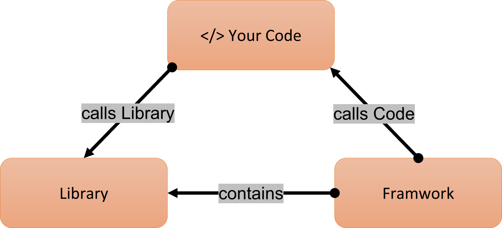

.. post:: 2022.11.06
   :tags: framework
   :category: SoftwareDesign
   :author: TIAN Zeyu

Software Frameworks
#####################

A framework is a special kind of library that does not contain “finished” functions like a regular library. Frameworks
are rather programme scaffolds that provide the blueprint but not the finished unit. A framework is like the foundation
upon which developers build applications for specific platforms. It includes reusable pieces of code written to perform
common tasks and uses code provided by a developer for custom functionality.

The framework provides the flow of a software application and tells the developer what it needs and calls the code
provided by the developer as required. If a library is used, the application calls the code from the library.

There are **technical differences** between library and framework. One core difference between a framework and a library is
the use of queries. When using a library, the programmer decides when and where to call it. When using a framework, the
framework dictates that. It provides the basic framework and tells the programmer what is needed. Accordingly, the necessary
code is inserted by the developer and supplements the framework according to the desired function. In the end, however,
it is the framework that calls up the code when it needs it and is also responsible for the running of the programme.

Frameworks and libraries are code written by third parties to solve regular/common problems or to optimise performance.
A key difference between the two is the **inversion of control**.

* When using a library, the control remains with the developer who tells the application when to call library functions.
* When using a framework, the control is reversed, which means that the framework tells the developer where code needs
to be provided and calls it as it requires.

Frameworks contain key distinguishing features that separate them from normal libraries:

* **inversion of control**: In a framework, unlike in libraries or normal user applications, the overall program's flow of control is not dictated by the caller, but by the framework.
* **default behavior**: A framework has a default behavior. This default behavior must be some useful behavior and not a series of no-ops.
* **extensibility**: A framework can be extended by the user usually by selective overriding or specialized by user code to provide specific functionality.
* **non-modifiable framework code**: The framework code, in general, is not supposed to be modified, while accepting user-implemented extensions. In other words, users can extend the framework, but should not modify its code.

* **The disadvantage** of frameworks is that temptation to add more and more functionality creates a lot of bloated frameworks which results in immobility and needless complexity.

When to develop your own framework:
* License issues
* Company specific requirements that didn’t exist in current frameworks
* The company wants to have control over support and maintenance of the framework
* The architect didn't know better! He/she didn't know about that specific framework existed, so they decided to reinvent the wheel.
* Enterprises prefer to reinvent the wheel rather than using "small" frameworks, the cost may be more if framework used in company application is deprecated and no longer supported, or licenses are changed

Type of framework
=================
* web app framework
    * fullstack
        * Django - Python
        * AngularJS - JavaScript
        * Laravel - PHP
    * microframework - minimalistic web application frameworks
        * bottle
        * aiohttp
        * cherryPy
* DataScience Frameworks
    * Apache Spark - large-scale data processing
    * Pytorch
    * TensorFlow
* mobile app framework
    * Ionic (android)
    * Xamarin (android)
    * Flutter (google UI)

* technology framework
* enterprise architecture framework
* database framework
* testing framework

Reference
=========
- https://www.interviewbit.com/blog/framework-vs-library/
- https://kruschecompany.com/framework-vs-library
- https://stackoverflow.com/questions/148747/what-is-the-difference-between-a-framework-and-a-library
- https://www.quora.com/What-is-a-framework-and-what-are-the-different-types-of-frameworks

